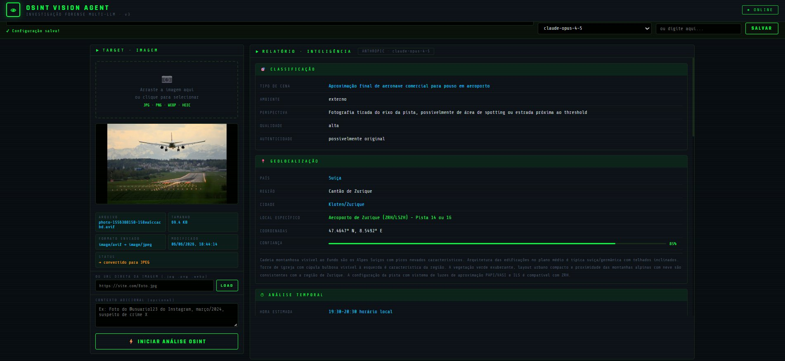
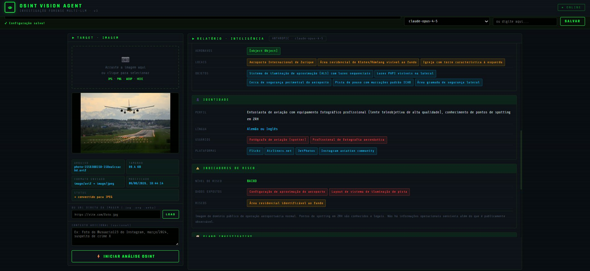
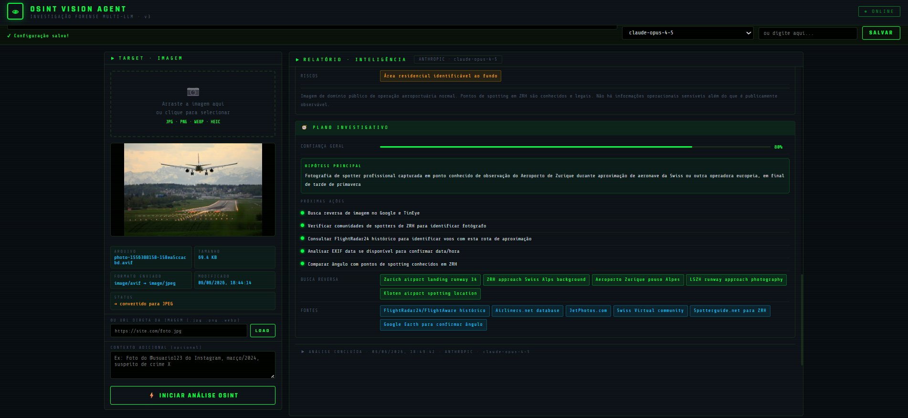

# 👁 OSINT Vision Agent

> Forensic image investigation tool powered by multiple LLMs via computer vision.

**Author:** Bruno Lobo  
**License:** MIT  
**Version:** 3.0

---

## 🔍 What is it?

**OSINT Vision Agent** is an open-source intelligence (OSINT) tool that analyzes any image and extracts the maximum amount of investigative information possible, including:

- 📍 **Implicit geolocation** — country, city, specific location, estimated coordinates
- ⏱ **Temporal analysis** — time of day, season, probable date
- 🔍 **Identified entities** — people, vehicles, aircraft, establishments
- 💾 **Digital clues** — visible text, watermarks, UI interfaces, QR codes
- 👤 **Identity profile** — possible users, suspected platforms
- ⚠️ **Risk indicators** — exposed sensitive data, privacy risks
- 🧭 **Investigative plan** — main hypothesis, next actions, reverse search queries

---

## 🖥️ Screenshots

### 📍 Geolocation Analysis
> Aircraft approach photo → identified as **Zurich Airport (ZRH/LSZH), Switzerland** with **85% confidence**



### 🔍 Entities & Identity Profile
> Identified airport infrastructure, ALS lighting, PAPI lights, residential area and photographer profile



### 🧭 Investigative Plan
> Main hypothesis, next OSINT actions, reverse search queries and recommended sources



---

## 🤖 Supported Providers

| Provider | Models | API Key |
|----------|--------|---------|
| 🟢 **Claude (Anthropic)** | claude-opus-4-5, sonnet-4-5, haiku-4-5 | [console.anthropic.com](https://console.anthropic.com) |
| ⚪ **GPT-4o (OpenAI)** | gpt-4o, gpt-4o-mini, gpt-4-turbo | [platform.openai.com](https://platform.openai.com) |
| 🔵 **Gemini (Google)** | gemini-2.0-flash, 1.5-pro, 1.5-flash | [aistudio.google.com](https://aistudio.google.com) |
| 🔴 **Groq (Cloud)** | llama-4-scout, llava, llama-3.2-vision | [console.groq.com](https://console.groq.com) *(free tier)* |
| 🟣 **Ollama (Local)** | llava, moondream, llama3.2-vision | No key needed — runs offline |

---

## 🚀 How to Use

### Option 1 — Direct in browser (no installation required)

1. Download the `osint_agent.html` file
2. Open it in your browser (Chrome, Firefox, Edge)
3. Select the desired LLM provider
4. Enter your API Key and click **SAVE**
5. Drag an image or paste a URL
6. Click **⚡ START OSINT ANALYSIS**

> API Keys are saved only in your browser's `localStorage`. No data is sent to third-party servers beyond the chosen LLM.

### Option 2 — Ollama Local (100% offline, no data sent)

```bash
curl -fsSL https://ollama.ai/install.sh | sh
ollama pull llava
OLLAMA_ORIGINS=* ollama serve
```

Then open `osint_agent.html`, select **🟣 OLLAMA LOCAL** and use `http://localhost:11434` as the endpoint.

---

## 📸 Supported Image Formats

| Format | Native API Support | Auto Conversion |
|--------|--------------------|-----------------|
| JPEG | ✅ | — |
| PNG | ✅ | — |
| WebP | ✅ | — |
| GIF | ✅ | — |
| AVIF | ❌ | ✅ via canvas |
| HEIC | ❌ | ✅ via canvas* |
| BMP | ❌ | ✅ via canvas |
| TIFF | ❌ | ✅ via canvas |

---

## 🔎 Investigative Use Cases

- **Aircraft window photo** → identifies airline, probable route, origin/destination airport
- **Street photo** → determines country and city from architecture, signage, vehicles, vegetation
- **Selfie in public place** → identifies background establishment, time of day from sunlight
- **Screenshot** → extracts time from status bar, app, carrier, system language
- **Event photo** → identifies venue from stage/banners, probable date, visible people
- **Missing person image** → extracts all visual clues for investigation

---

## 🏗 Repository Structure

```
osint-vision-agent/
├── osint_agent.html
├── docs/screenshots/
│   ├── demo-geolocation.png
│   ├── demo-entities-identity.png
│   └── demo-investigative-plan.png
├── README.md
├── LICENSE
└── .gitignore
```

---

## ⚠️ Legal Disclaimer

This tool is intended exclusively for legitimate security investigations, academic OSINT research, authorized forensic analysis, and protection of missing persons. **Use for illegal purposes or unauthorized surveillance is expressly prohibited.**

---

## 📄 License

MIT License — see the [LICENSE](LICENSE) file for details.  
Copyright (c) 2026 Bruno Lobo
